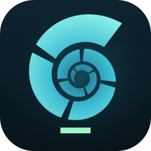
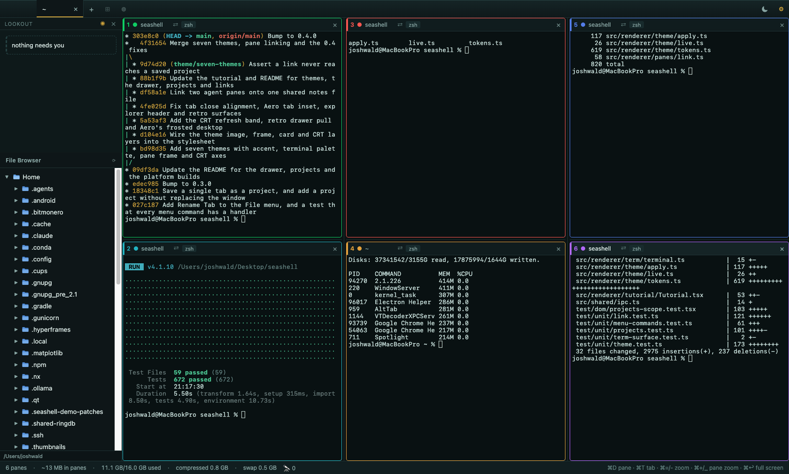
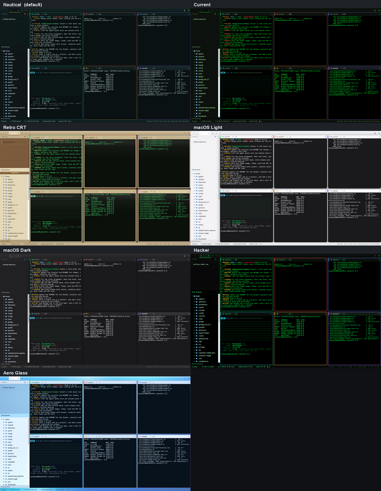

<p align="center">
  
</p>

<h1 align="center">SeaShell</h1>

A terminal window manager. Run many shells side by side in one window — plain
`zsh`, a dev server, or several AI coding agents — and keep a file explorer next to them.
macOS is the reference platform; Windows and Linux builds are experimental.

<p align="center">
  
</p>
<p align="center"><i>Six panes in one window, in the Nautical theme.</i></p>

**[⬇ Download the latest release](https://github.com/voidharbor/seashell/releases/latest)** — macOS · Windows · Linux

**Built for running Claude Code.** SeaShell works with any terminal program, but every design
decision that had a tie-breaker was settled in favour of watching several long-running agent
sessions at once. That is what it is for.

**Agents work while you're not watching. So run six.** A session only needs you for the ten
seconds it stops to ask something. Tile six of them in one window, let the cards catch each
question the moment it lands, and answering becomes your whole job — the agents do the rest.
That's how one person ships like six.

> **Status: pre-alpha.** Under active development.

## Install

Download the `.dmg` from [Releases](https://github.com/voidharbor/seashell/releases), open it,
and drag SeaShell to Applications. The build is universal — it runs natively on Apple Silicon
and Intel, no Rosetta.

### First launch: "SeaShell cannot be opened"

macOS will refuse to open it the first time, with either *"cannot be opened because the
developer cannot be verified"* or *"is damaged and can't be opened"*. **The app is fine.** That
message means it was not signed with a paid Apple Developer ID, so macOS flagged it when your
browser downloaded it.

Clear the flag:

```bash
xattr -dr com.apple.quarantine /Applications/SeaShell.app
```

Then open SeaShell normally. You only ever do this once.

<details>
<summary>Without using Terminal</summary>

Open System Settings → Privacy & Security, scroll down to the message about SeaShell, and click
**Open Anyway**. Then launch the app again and confirm.

On macOS 15 (Sequoia) and later this is the only click-through route — Apple removed the old
right-click → Open shortcut.
</details>

If you copy the app across by USB stick, `scp`, or a shared folder instead of downloading it,
macOS never sets the flag and none of the above applies. It just opens.

## Why

Terminal multiplexers make you choose. `tmux` and `zellij` are excellent but live inside a
single terminal window and bring their own keybinding grammar. Tabbed terminal emulators give
you tabs but only ever show you one thing at a time.

SeaShell is built around a narrower goal: **watch several long-running sessions at once**, and
work with the files they mention without leaving the window.

## Working with Claude Code

Running agents is not the same as running commands. An agent session lasts hours, spends most of
that time either thinking or waiting on you, and prints paths you immediately want to look at.
These exist because of that:

- **Panes tell you when they want you.** A pane breathes its border while its program sits waiting
  for input, and pulses briefly when a job finishes — never the pane you are already looking at.
  The distinction matters: an agent showing a spinner is emitting bytes constantly while doing
  nothing, so idle detection keys on what the foreground process is actually doing, not on output.
  An optional ping sounds the moment a pane starts asking.
- **Sleep.** One click in the tab bar stops every pane asking, glow and ping together, for when you
  need to concentrate on one of them.
- **Panes name themselves.** A pane takes the title the running program sets — Claude Code
  publishes its session summary that way — so six agents read as six pieces of work instead of six
  panes all labelled `claude`. Colour tags, automatic or hand-picked, tell them apart at a glance.
- **Closing a pane really closes it.** An escalating kill ladder reaps the pane's whole process
  tree, including anything that double-forked away from the shell. Forgotten agent sessions
  quietly eating a 16 GB machine is the problem this app was built to end; panes over 200 MB show
  their memory in the title bar.
- **Paths and previews.** Double-click a path an agent printed and the explorer reveals it. Inside
  a full-screen program that claims the mouse, hold ⌥. Open the file and it becomes a tiled pane
  with syntax highlighting, beside the agent that mentioned it.
- **⌘A selects your input line**, not thousands of lines of scrollback — the difference between
  editing the prompt you are halfway through and selecting an entire transcript.
- **Shift+Enter sends ESC CR**, the multi-line-input binding agents expect, with no setup and
  without SeaShell touching your Terminal.app preferences.
- **Link two agents to share notes.** The ⇄ button in a pane's title bar links it
  to another agent pane. SeaShell cannot merge two conversations — each session
  owns its own context — so a link is one shared notes file plus a single
  briefing to each agent telling it where that file is. From then on they keep
  each other current by reading it before a task and appending after one, which
  is what lets two sessions work the same project without you relaying between
  them. Only panes actually running an agent can be linked, nothing is relayed
  between panes afterwards, and the file lives in SeaShell's own data directory
  rather than in your working tree.
- **A pane is a real login shell.** Your dotfiles, your PATH, your history. Nothing is wrapped or
  intercepted, and the environment a pane inherits is scrubbed of SeaShell's own identity so a
  nested launch cannot confuse the agent running inside it.

## Lookout

Watching several agent panes means someone still has to notice the one that stopped to ask
you something. Lookout does that noticing: the moment an unfocused pane goes idle on a
question, a **card** appears in a rail beside the panes with the question on it, and a badge
in the status bar counts every card waiting on you — the pane you are already looking at gets
counted there too, just without a card of its own.

Two lanes feed the same stack:

- **Detector, built in.** SeaShell watches for a claude pane idle on a question and raises a
  card with canned replies — `Continue` / `Yes` / `No`, `Go to pane`, dismiss. No config, no
  tokens, no external process, on every platform.
- **Drafted replies, via a plugin.** With the c-assistant companion plugin installed, a Claude
  Code Stop hook drafts a one-line reply in your voice and pushes a richer card over the
  control socket — `Approve ✓`, `Edit`, `Deny ✕`. A pushed card replaces the detector's card
  for the same pane.

The safety model is one rule regardless of lane: external tools can only propose a card, and
only your own click inside SeaShell ever submits it into the pane. A card on a pane showing a
picker screen is look-only — there is no single word to send into a menu, so it shows the
question and stops there.

Smart drafted cards require the c-assistant companion plugin:

```bash
/plugin marketplace add voidharbor/claude-plugins
/plugin install c-assistant@voidharbor
```

For the full skill set, install the voidharbor bundle instead — `/plugin install voidharbor@voidharbor`
installs all of voidharbor's skills at once, Lookout hooks included, so the bundle alone is
enough for drafted cards. Installing both is also fine: the hooks detect the duplicate and
only one copy runs per session.

**Turning it off.** The **◉** button in the Lookout header is the switch: one click stops the
watching and clears whatever is already in the rail. The same toggle lives in Settings under
*Approval cards*. Note the difference from **⇧⌘B** and the **✕** beside it — those hide the
section, which is a panel toggle, not an off switch: detection keeps running behind it and
cards keep stacking up out of sight.

## Themes

<p align="center">
  
</p>
<p align="center"><i>One window, seven themes. Same panes, same output, same moment.</i></p>

Settings > Appearance. Seven built-in themes: **Nautical** (the default, oxidised
teal and brass), **Current** (exactly what the app looked like before themes),
**Retro CRT**, **macOS Light**, **macOS Dark**, **Hacker**, and **Aero Glass**.

Three dials sit beside the theme and compose freely with it:

- **Accent** — a fixed palette rather than a colour picker. What is stored is the
  key, so a future palette revision re-resolves instead of stranding a hex.
- **Terminal palette** — recolours the terminals themselves, not just the chrome.
  Theme native, Solar, Amber mono or Ice. Existing scrollback repaints in place.
- **Pane frame** — hairline, bezel, floating or slab, or whatever the theme picks.

**CRT glass is independent of the theme.** Scanlines, an irregular flicker, curved
glass and a rolling refresh band, on for Retro CRT by default but available over
any theme. All of it respects `prefers-reduced-motion`.

Themes change colour and shape only. Every dimension belongs to the zoom system,
so no theme can resize your interface.

## What it does

- **Tiled panes.** Each tab holds an auto-arranged grid of up to six terminals, in
  `ceil(sqrt(N))` columns: one, then two side by side, then quadrants, then three columns.
  Drag the borders to resize. Double-click a pane's title bar to zoom it to full tab, again to
  restore.
- **Any command per pane.** A pane is just a PTY. Run `zsh`, a build watcher, an SSH session,
  or a coding agent. Full-screen TUI programs render exactly as they do in a native terminal —
  alternate screen buffer, 24-bit color, correct glyph widths.
- **Built-in file explorer.** A lazy-loaded tree beside the panes. Drag a file into a terminal
  to paste its quoted path.
- **Paths become clickable.** Any filesystem path printed in a pane is detected and verified
  against disk. Double-click it and the explorer expands to that file and highlights it —
  nothing is opened behind your back. Opening is a separate, deliberate act from the tree.
  Bare URLs in output are clickable too, and open in your browser.
- **Preview panes.** Open a file and it becomes a tiled pane beside your terminals with syntax
  highlighting; point a web preview at a URL and watch a dev server render next to the pane
  running it. Previews are ordinary leaves in the layout tree, so they resize with the same
  dividers, zoom with the same ⌘⏎ and close with the same ⌘W as everything else.
- **Resource visibility.** Each pane reports the memory of its whole process subtree, and panes
  sitting idle say so. Long-lived agent sessions are easy to forget; this makes them visible.
- **Closing a pane means it.** Closing runs an escalating kill ladder across the pane's whole
  process tree — including background jobs and descendants that double-forked away from the
  shell. If anything survives, it says so rather than pretending the pane was clean.
- **A scratch shell for each pane.** ⌘J opens a shell drawer over the grid, and every pane gets
  its own, starting in that pane's working directory. Switching panes switches shells, each
  keeping its own history and scrollback. A quick `git status` costs neither a new pane nor an
  interruption to the agent running in one.
- **Tabs group panes; projects save them.** A tab is a named set of panes, renamed by
  double-clicking its name or from File > Rename Tab. A project saves an arrangement by name
  and reopens it later with each pane's directory, colour and layout, resuming a pane's Claude
  Code session by running `claude -r` where you can watch it. Save the whole window, or just
  the active tab. Opening a project replaces the window; adding one brings its tabs in
  alongside whatever is already running.
- **Zoom that stays sharp.** ⌘+ / ⌘− scale the terminal text and the interface together. The
  font steps through only sizes whose advance lands near a device-pixel boundary, because the
  WebGL renderer floors `charWidth * dpr` and anything else drifts into misaligned borders.

Press ⌘/ for a short tutorial of the parts that aren't guessable.

## Design

The full design specification lives in
[`docs/superpowers/specs/`](docs/superpowers/specs/). It covers the layout engine, PTY
lifecycle, path detection, IPC contract, security posture, and build pipeline in enough detail
to implement from.

## Building

Requires macOS, Node 24 or newer, and Xcode command line tools. CI builds on Node 24; older
versions are untested.

```bash
npm install
npm run dev            # run from source
npm run build          # compile to out/
npm run pack:mac       # SeaShell.app for this machine's architecture
npm run dist:mac       # universal .dmg for distribution
```

A universal build works from an Intel host with no cross-compiling. `node-pty` 1.1.0 is
Node-API and already ships prebuilds for both `darwin-x64` and `darwin-arm64`, so nothing needs
recompiling — the loader picks the right one at runtime.

Two settings in `electron-builder.yml` are what make that true, and both are load-bearing:

- **`npmRebuild: false`** — it defaults to `true`, which rebuilds `node-pty` into
  `build/Release` for the host arch only. node-pty's loader prefers `build/Release` over
  `prebuilds/`, so a "universal" build made on an Intel Mac would ship an x64-only PTY layer:
  perfect locally, dead on every Apple Silicon machine.
- **`x64ArchFiles`** — `@electron/universal` aborts when it finds a non-universal Mach-O
  present identically in both slices. The per-arch `node-pty` prebuilds are exactly that, on
  purpose.

The app is ad-hoc signed (`codesign -s -`), which is what Apple Silicon requires in order to
execute at all. It is **not** signed with a Developer ID and not notarized, which is why the
quarantine step in [Install](#first-launch-seashell-cannot-be-opened) exists.

## Non-goals

SeaShell deliberately does not do these things:

- **Edit files.** File previews are read-only. Use your editor.
- **Manage remote sessions.** No SSH profile management.
- **Restore sessions.** A project saves an arrangement, not a session. No scrollback, no
  running processes, nothing that only means something while the app is up. A restored pane is
  a fresh login shell at the saved directory.
- **Treat Windows and Linux as first-class.** Both are built and published, but macOS is the
  reference platform and the others are experimental. On Windows the kill ladder reports
  `verifiedKill: false`: the pseudoconsole terminates ordinary children, but a process that
  detached survives and nothing there can count it, which is the one guarantee this app exists
  to make. Process metrics and working-directory reporting are absent there too. Treat that
  build as something to test rather than something to rely on.
- **An extension API.** No plugin system, no theme editor. Themes are a fixed
  built-in set (seven of them, with accent, terminal palette, pane frame and CRT
  as separate axes) rather than something a third party can add to.
- **Replace your browser.** The web preview exists for adjacency — a page next to the pane
  serving it. It saves no memory: Chromium costs about the same per page wherever it renders.

## License

[Apache-2.0](LICENSE).
